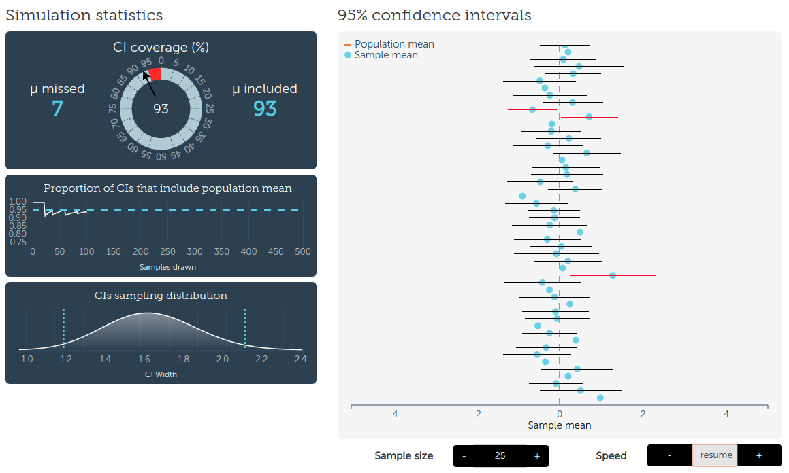

# Inference and Attribution in Watershed Hydrology

## FRST 590: Statistical Methods in Hydrology

**Submitted**: 29 March 2019
**Prepared by**: Dan Kovacek (35402767)

### 1.0 Motivation

A commentary on the current state of research into the effect of changing land use and land cover (LULC) on streamflow and floods at the catchment scale is presented in *Rogger et al. [2017]*.  In the process of delineating gaps in the existing research, the authors describe the need for new approaches to obtain more general statements on impacts, citing the regularity with which studies obtain contradictory results for the same *kind of change*, or intervention.  *Rogger et al. [2017]* highlights two such studies:

>*"Some recent publications such as the paper of Gupta et al. [2015] on the relative impacts of climate and land use changes on streamflow or that by Alila et al. [2009] about the effects of forest practices on floods have triggered scientific debates with the results being criticized by many scientists."*

To gain more quantitative insights into the impacts of LULC on hydrological trends, perhaps new quantitative approaches are needed, as *Rogger et al. [2017]* argues.  A clearer understanding of the distinguishing characteristics and appropriate use of existing approaches may be equally valuable.  *Cox [2006]* argues that the translation of a subject-matter problem into a formal statistical question is often the most critical part of the analysis.   The aim of this paper is to determine whether the conclusions arrived at in *Gupta et al. [2015]* are justified by the approach.  First, a general outline of statistical inference is presented to provide context for the subject-matter translation problem.  A summary and discussion of the *Gupta et al. [2015]* study then follows to determine its capacity for inference, and finally the conclusions of the study are compared to the model's capacity for inference.

### 2.0 Background {#section2}

#### 2.1 Paradigms of Statistical Inference

Some of the difficulty in reviewing the statistical literature is due to the prevalence of value statements invoking blame, guilt, and fear, none of which contribute to the understanding of science. [@Lloyd_2018]  Certainly no discipline or body of literature is perfect, however some of the lack of understanding of statistics often decried in the literature may instead be an indication of the similarities between the established paradigms of statistical inference.  The prominent statistician D.R. Cox broadly defined inferential statistics by the following paradigms, presented here in the briefest of summaries:

* **Frequentist**: inference of system behaviour is measured from data alone, assuming the unknown parameter of interest is *fixed*. [@Cox_inference_2006]  The traditional approach of R.A. Fisher, Neymann, and Pearson is to formalize a set of rules to govern behaviour such that in the long run, we won't be wrong too often. [@Lakens_2017]
* **Bayesian**: inference of system behaviour is measured from data, but prior knowledge (inherently biased) is incorporated by assuming the unknown parameter of interest is *probabilistic*. [@Cox_inference_2006]  Quality of evidence is expressed in terms of 'degrees of belief'. [@Lakens_2017]

*Lindley [2000]* states that the concern of statistical analysis is evaluating uncertainty, and the fundamental problem of statistical inference is in using past data to predict future data.  Uncertainty in quantifying some parameter of interest can be separated into two distinct and fundamental types: *natural* uncertainty is attributatble to the variability of the underlying stochastic process, while *epistemic* uncertainty lies in the incomplete understanding of the greater system under study. [@merz_2005]  Quantifying information about some unknown parameter or a system of interest is related to the separation of aleatoric (natural) and epistemic uncertainty.  [@weijs_2013]

While the treatment of the statistical discipline in *Lindley [2000]* entirely avoids the language of causality and attribution, causal inference is a more recently established paradigm (despite independent origins in the 1920s from both Barbara Burks and Sewall Wright) putting causality central in the approach to statistical inference. [@Pearl_2009]  *Pearl [2018]* argues that causality is not just an extreme condition of association, as the majority of the field contends.  The capacity to evaluate nonexistent *"what-if"* scenarios, or counterfactuals, is the more advanced level of inference that the field of artificial intelligence strives for, and mere association (i.e. linear regression, machine learning) is the most primitive level. [@Pearl_2018_why]  Statistical inference can thus reasonably include both *associative* and *causal* sub-categories.  *Likelihood* and *Information* are additional established paradigms of statistical inference that are beyond the scope of this discussion.

The variety of ways of expressing like methods is a natural outcome of the application of statistics across the breadth of academic disciplines with little reason or opportunity to share ideas.  Proof of the apparent interchangeability of methods is easily seen in a random sample of titles by submitting to an academic journal database the key words "Frequentist" and "Bayesian".  Even the work of a single author may evolve over time to favour different paradigms, as well established statisticians have noted their support for one paradigm or other evolving over their career. ([@Pearl_2018_why], [@Lindley_2000_philosophy_of_stats])

Similarly, part of the challenge in reviewing the hydrological literature lies in the nuanced description and integrated application of statistical methods.  In the field of hydrological research, there are numerous and varied approaches to the measurement and prediction of runoff, as well as to the attribution of physical causes to trends in observed data. [@Viglione_2016]  Causality is invoked by *Viglione et [2016]* by stating *"the attribution of physical causes"*.  *Rogger et al. [2017]* also invokes the language of causality in their criticism of the discipline:

>*"Studies that examine the impact of land use changes on streamflow and floods often obtain contradictory results for the same kind of change."*

Analysis of hydrometric data is undertaken in order to base decisions upon expectations of future behaviour of some unknown parameter of interest.  To gain any level of practical understanding of runoff at the watershed level, a model of some form must be employed.  Input variables to hydrological models are discrete observations in time and space, representing samples of components and mechanisms of the hydrologic cycle.  As such, hydrological analysis is inherently inferential, rather than merely descriptive.  One of the central tasks in the study of watershed hydrology is the determination of an appropriate model for the characterization of timing and quantity of runoff at a spatio-temporal scale of interest.  It is the model selection that determines the paradigm of statistical inference of the study.  The established inferential paradigms are not mutually exclusive, rather there are a variety of valid approaches to characterizations of the hydrologic cycle, and the validity of approach is dependent upon on the question being asked of the data.

#### 2.2 Modelling Processes: Deterministic, Stochastic, and In-between

>*"Rather than idealized angels of reason, scientific models are powerful clay robots without intent of their own, bumbling along according to the myopic instructions they embody."* [@McElreath_2018]

Statistical study has two fundamental steps according to *Lindley [2000]*.  The first is model construction, which is necessarily subjective and requires careful consideration in order to ensure the model is consistent with reality.  The second is analysis, which is routine and ripe for automation. [@Lindley_2000_philosophy_of_stats]  The function of the model is to translate a subject-matter question into a formal statistical question. [@Cox_inference_2006]  However, even an otherwise correctly developed model can introduce errors if it is applied beyond the range of calibration data. [@Alila_2009]

Process-based analysis investigates pathways for the movement of water [@Bracken_2013]:

>*"While there is a current trend favouring process-based hydrological analysis over purely empirical approaches, there remains a lack of consensus in the definition and measurement of hydrological connectivity."*

The discussion of *"hydrological connectivity"* in *Bracken [2013]* suggests there is plenty of room for new developments in deterministic modelling, but makes no mention of stochastic processes or Bayesian inference.

Hydrological processes occur on many different scales, both deterministic and stochastic in nature.  *Sivakumar [2017]* places the two terms at extremes in describing the complexity of systems, and adds a third term to describe the space between these extremes:

* **deterministic**: order and dependence exist at certain spatiotemporal scales, such as annual river flow and daily temperature,
* **stochastic**: nonlinear interactions dominate the hydrologic cycle yielding random and irreproducible states of the real system, and
* **chaotic**: systems governed by three or more independent variables required to describe the state of a system (degrees of freedom) [@Gleick_chaos] can be deterministic in the short term, but irreproducible unpredictable in the long term due to sensitivity to initial conditions.

In the hydrologic cycle, interactions between components and mechanisms occur in many different ways, directly or indirectly, often in feedback forms, and in varying degrees of nonlinearity. Therefore the processes of the hydrologic cycle are stochastic in nature.  [@Sivakumar_2017]  But some level of determinism does exist in the hydrologic cycle, and deterministic, or process-based models are combined with stochastic models in practice.  [@Kouts_2016_stochastic]  While in the short term, there is determinism and order in a low complexity system, such as the rainfall-runoff response of a a small, highly developed catchment, the sensitivity of even a simple rainfall-runoff model of very few degrees of freedom can be highly sensitive to initial conditions and are unpredictable in the long-term. [@Sivakumar_2017]

A hydrological model can either be designed to yield some level of certainty about an unknown parameter (or treatment effect) given specific requirements for input, or conversely, a quantitative statement about the quality of estimation of the unknown parameter (or treatment effect) can be determined given fixed input.  How the quality of predictions are communicated is addressed in the subsequent section.

#### 2.3 Communicating Effects: P-Value, Significance, Confidence, and Equivalence

Interpretations of model outcomes are assisted by specific metrics to make the information useful for a practical application, regardless of the model type.  The way the effect of a treatment is measured and communicated has been the source of ongoing debate for generations ([@Merz_2012_epiuncert], [@Alila_2009], [@Lloyd_2018], [@Pearl_2018_why], [@Gupta_2015])  Since real systems tend to be highly complex, it is necessary to have different approaches to evaluate the effect of some parameter of interest or treatment. This discussion is limited to terms relevant to the methodology presented in *Gupta et al. [2015].*

The underlying principle of the frequentist analysis recognizes that drawing conclusions from data is error prone, assuming long-term use of the implications of data, or the unknown parameter of interest. [@Cox_inference_2006]  Suppose a study aims to measure the effect of some treatment, with the null hypothesis that there is no effect (H = no effect).  The study wants to have a high level of certainty that the outcome, stated as the rejection or affirmation of H, will be the same *in the long run*, for future experiments (given the same number of observations).  The confidence interval is chosen by setting rules for testing such that (typically) 95% of future outcomes are consistent with the assumption that H is true. The remaining studies (typically 5%) resulting in the opposite outcome with respect to the assumption of H being true is the type 1 error rate, or the alpha level.  The concept of the 95% confidence interval (CI) with long-term, finite sampling from a stationary population is illustrated in [Figure 1](#Fig1), below. (source: [Kristoffer Magnusson @ RPsychologist.com](https://rpsychologist.com/d3/CI/))

{#Fig1}

The p-value is a measure of surprise in the data.  The lower the p-value, the greater the surprise.  The significance of a statistical test is determined by comparing the result of the test (the p-value) to the alpha level ($\alpha$), or type 1 error rate.  Critics of the use of p-values point to the large number of studies reporting "no effect" for $P > \alpha$, when this is entirely not the case. [@Lakens_2017]  Assuming H is true, where the result of a significance test is $P > \alpha$, the only correct conclusion is that the data are not surprising. [@Lakens_2017]  However, it is still common in the literature to see statements that an effect is "statistically significant" if $P < \alpha$ [@Lindley_2000_philosophy_of_stats] and concluding "no effect" with $P > \alpha$. [@Lakens_2017]

A statement of the quality, or confidence level, of an estimated parameter is only as informative as it relates to some size of effect that is interesting or useful [@Lakens_2017].  The size of an effect might be evaluated in terms of the difference in some parameter between two groups, one receiving a treatment and one not (the control). A statistical test in this case expresses the difference of the unknown parameter in terms of equivalence.  The equivalence measure relates a *subjective* interval, or magnitude of an effect, that is considered to be of practical significance.  For instance, if a parameter of interest is evaluated in two independent samples, and the difference between the two is determined to be within the measurement precision, it cannot reasonably be claimed that an effect has been measured.  Note that this statement does not claim there is no effect.  In many cases the measurement error may be small, and there may be a practical effect size related to some outcome, such as a materially different design or policy implementation.  In this case, a statistical equivalence test uses bounds that are of practical significance to the application.

*Lindley [2000]* argues that significance level and confidence, which are descriptions of parameters and not data, do not obey the probability calculus, and holds that the connection between two sets of data, expressed through a parameter $\theta$, can only be evaluated probabilistically.  The distinction between significance, confidence, and probability is described as the following (where H is the hypothesis that the treatment has no effect) [@Lindley_2000_philosophy_of_stats]:

* **significance level**: the probability of some aspect of the data, given H is true,
* **probability**: your probablity of H, given the data
* **confidence**: probability that the interval includes $\theta$
* **probability (restated)**: probability that $\theta$ is included in the confidence interval

The differences in the above statements are subtle in print, but have important mathematical consequences, as *Lindley [2000]* details.  The preceding discussion presented a general overview of statistical inference, modelling, and evaluation, and was written to provide specific context for the summary of *Gupta et al. [2015]* that follows.

### 3.0 *Climate and agricultural land use change impacts on streamflow in the upper midwestern United States* [@Gupta_2015]

#### 3.1 Summary

Analysis of measured runoff in 29 watersheds in Iowa and Minnesota demonstrates an increasing trend of annual runoff, coincident with a positive trend in annual precipitation.  *Gupta et al. [2015]* attempts to quantify the relative contributions of increased precipitation and changing land use and land cover (LULC) to the observed increase in runoff.  A secondary goal of the study is to explain the observation of constant evapotranspiration (ET) over the same period of time, by attempting to disaggregate the increasing ET from changing LULC and the decreasing ET from loss of wetlands.

Separating the measured record into two periods consistent with a Before-After-Control-Impact (BACI) analysis framework, *Gupta et al. [2015]* cites the extensive adoption of plastic drain tile in agricultural practices in the mid-1970s as the intervention, consistent with the break point adopted in previous studies. (see references in *Gupta et al. [2015]*)

*Gupta et al. [2015]* tests for a change in the relationship between streamflow versus precipitation by using a series of linear regression models of varying complexity, presented in more detail in the subsequent section.  The study found results statistically significant at the 5% level (95% confidence interval, $P < 0.05$) for 19 out of 29 watersheds using a multivariate linear regression model of average annual precipitation and runoff.  Using 5-year moving averages of precipitation and runoff, all 29 watersheds exhibit a significant shift in regression coefficients, suggesting increased runoff is attributable to increased precipitation alone.  A single control watershed with limited agriculture and development found no statistical difference in the relationship between precipitation and runoff for the two periods.  Given the results of the statistical tests, the authors conclude that increased streamflow over the study period is mainly due to increased precipitation, and that LULC change produced no effect.

In terms of the secondary question of the effect of ET on the relationship between precipitation and runoff, *Gupta et al. [2015]* concludes that the lack of effect of LULC change on streamflow is the result of comparable ET over the two periods.

#### 3.2 Discussion of the Study Assumptions

*Gupta et al. [2015]* asks a specific question of the data: how much of the observed increasing trend in runoff in the upper midwestern US is attributatble to improved soil drainage, and how much simply to the observed increasing trend in precipitation?  Restated in the terms introduced in [Section 2](#section2), what is the effect of treatment (LULC change) on the parameter of interest (mean annual runoff)? The methodology translates this subject-matter question to a statistical problem by creating two groups (pre-change and post-change) and testing for equivalence.

Previous studies, *Gupta et al. [2015]* argues, erroneously attribute increased runoff ratios to more effective soil drainage, by neglecting to consider that increased runoff ratios could also be due to increased soil moisture from increased precipitation.  Both of these process-based lines of logic are plausible, and the distinction highlights interdependent characteristics and processes of soil storage relevant to the nature of the subject-matter problem.

As noted previously, what is the purpose of evaluating annual runoff?    there is mention of the timing, which could be critical for seasonal availability for crops, or for erosion and sediment transport, or for flood damage.  Gupta is perhaps rightly critical of the methodology of studies cited, however th

translating the subject matter problem to the statistical question.

Stated using the counterfactual paradigm of *Pearl [2018]*, suppose we have two hypothetically identical basins, and we subject them to identical precipitation over some period of time.  If we improve drainage on one plot, will annual runoff increase?  If infiltration is constant over the time period, and evaporation is  as *Gupta et al. [2015]* assumes, it is clear from conservation of mass that

-Gupta says seasonal runoff ratio changes are not appropriate due to dependence of runoff on antecedent soil moisture in previous season.
-gupta makes the interdependence between precipitation, soil type, soil storage, and antecedent soil mosture, in arguing that previous studies have concluded LULC contribute to increased runoff due to increased runoff ratios from better drainage.  Gupta argues that, among other factors, these studies fail to consider that higher runoff ratios may be due to increased soil moisture from increased precipitation.

[@zhang_2006]

#### 3.3 Discussion of the Statistical Methodology

Runoff and precipitation data from 1966 to 2009 were used in the BACI study, with the breakpoint between the two periods, corresponding to widespread adoption of plastic tile drainage in agriculture, set at 1975.  The system of models are described by the following equations (1), (2), and (3):

$$ln(Q_{all}) = \beta_0 + \beta_1 \cdot P_{all} + \beta_2 \cdot I + \beta_3 \cdot P \cdot I \hspace{2.25cm} (1)$$

$$ln(Q_{all}) = \beta_4 + \beta_5 \cdot P_{all} + \beta_6 \cdot I \hspace{4cm} (2)$$

$$ln(Q_{all}) = \beta_7 + \beta_8 \cdot P_{all} \hspace{5.2cm} (3)$$

Statistical tests of the coefficients ($\beta_0, ..., \beta_8$) are used to measure whether the relationship between streamflow and precipitation for the two periods of interest are better represented by

Using annual precipitation and runoff volumes, *Gupta et al. [2015]* posits that a change in the linear relationship between precipitation and (the natural logarithm of) runoff should be indicative of a change in how the watershed converts precipitation to streamflow. [@Georgiou_2015]

In each model, *I* has a value of 0 or 1 based upon the period, such that pre and post-change periods are assigned separate coefficients.  ANOVA tests for significant difference in the

Temporal trends in annual precipitation are demonstrated in two ways, one using the Mann-Kendall nonparametric test, and the other by calculating mean annual precipitation for three periods: 1920-1949, 1950-1979, and 1980-2009.

-where does the moisture come from?

-what about uncertainty in ET estimation?  Methodology:

$$ET = PPT - Q - \Delta S - D $$

-Gupta explicitly avoids invoking cause and effect

Pan evaporation is a measure of evaporative demand, and is driven by humidity gradients, temperature, wind speed, and solar insolation. [@Roderick_2007]  Investigating a widely observed global trend in decreasing pan evaporation, *Roderick et al.* [2007] modeles the components of evaporative demand and attributed the decline in measured pan evaporation between 1975 and 2004 to a reduction in wind speed along with regional reduction in insolation.  Note that pan evaporation data were used based on a single location to represent evapotranspiration across all of Minnesota and Iowa.  Average wind speeds are spatially variable across Minnesota and Iowa [@Harding_2012_precip_recycling]

The study cites evidence of the spread of agrigultural practices, including the use of drainage ditches and subsurface drain tile, beginning in the early 1900s.  This assumption thus neglects the existing drainage and subsurface drain tile, in use for three quarters of a century prior to the set breakpoint in study periods (1975).  Numerous related studies viewing widespread adoption of plastic drain tile in the mid 1970s as the major cause of increased runoff ([@Schill_Libra_2003], [@Raymond_2008], [@Wang_2011], [@Xu_2013], [@Schottler_2015]).  But without evidence of performance and/or soil moisture measures to defend the null hypothesis (no effect of drainage tile), the intervention being investigated is then limited to the performance of modern plastic drain tile versus the older clay tile.

Alila:
-dominant process theory (moderate correlation between April 1st SWE and peak flows)
-frequency pairing
-chronological pairing
-what does Alila say are the causes of changes in variability?  What are the ways he suggests this is demonstrated in the data?
-what is the logical fallacy of composition?  The inference that something is true of the whole from the fact that it is true of some part of the whole

-in pursuing the argument of the effect of forest storage on the frequency of floods, there is an implicit argument that forest harvesting, which tents to increase variability of runoff, changes the FFC.  If the effect of forest harvesting translates the FFC in the positive vertical direction, the mean is necessarily affected.  If the effect of forest harvesting has no effect on the lowest probability events, but has an effect on the higher probability events, the mean is necessarily affected.  The logical

Gupta:
-chronological pairing
-ANOVA/ANCOVA

-possibility of delayed or transient effects of intervention (Murtaugh 2002)

### 4.0 References