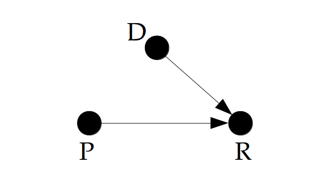
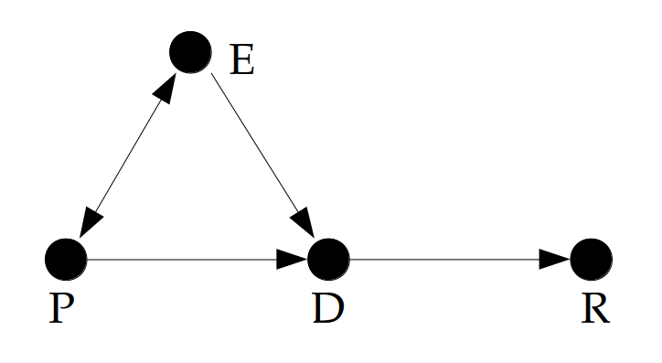

# Inference and Attribution in Watershed Hydrology: Commentary on *Climate and agricultural land use change impacts on streamflow in the upper midwestern United States* [@Gupta_2015]

## FRST 590: Statistical Methods in Hydrology

**Submitted**: 29 March 2019
**Prepared by**: Dan Kovacek (35402767)

## 1.0 Motivation

A commentary on the current state of research into the effect of changing land use and land cover (LULC) on streamflow and floods at the catchment scale is presented in *Rogger et al. [2017]*.  In the process of delineating gaps in the existing research, the authors describe the need for new approaches to obtain more general statements on impacts, citing the regularity with which studies obtain contradictory results for the same *kind of change*, or intervention.  *Rogger et al. [2017]* highlights two such studies:

>*"Some recent publications such as the paper of Gupta et al. [2015] on the relative impacts of climate and land use changes on streamflow or that by Alila et al. [2009] about the effects of forest practices on floods have triggered scientific debates with the results being criticized by many scientists."*

To gain more quantitative insights into the impacts of LULC on hydrological trends, perhaps new quantitative approaches are needed, as *Rogger et al. [2017]* argues.  A clearer understanding of the distinguishing characteristics and appropriate use of existing approaches may be equally valuable.  *Cox [2006]* argues that the translation of a subject-matter problem into a formal statistical question is often the most critical part of the analysis.   The aim of this paper is to determine whether the conclusions arrived at in *Gupta et al. [2015]* are justified by the approach.  First, a general outline of statistical inference is presented to provide context for the subject-matter development and translation problem.  A summary and discussion of the *Gupta et al. [2015]* study then follows to determine its capacity for inference, and finally the conclusions of the study are compared to the model's capacity for inference.

## 2.0 Background {#section2}

### 2.1 Paradigms of Statistical Inference

Some of the difficulty in reviewing the statistical literature is due to the prevalence of value statements invoking blame, guilt, and fear, none of which contribute to the understanding of science. [@Lloyd_2018]  Certainly no discipline or body of literature is perfect, however some of the lack of understanding of statistics often decried in the literature may instead be an indication of the similarities between the established paradigms of statistical inference.  The prominent statistician D.R. Cox broadly defined inferential statistics by the following paradigms, presented here in the briefest of summaries:

* **Frequentist**: inference of system behaviour is measured from data alone, assuming the unknown parameter of interest is *fixed*. [@Cox_inference_2006]  The traditional approach of R.A. Fisher, Neymann, and Pearson is to formalize a set of rules to govern behaviour such that in the long run, we won't be wrong too often. [@Lakens_2017]
* **Bayesian**: inference of system behaviour is measured from data, but prior knowledge (inherently biased) is incorporated by assuming the unknown parameter of interest is *probabilistic*. [@Cox_inference_2006]  Quality of evidence is expressed in terms of 'degrees of belief'. [@Lakens_2017]

*Lindley [2000]* states that the concern of statistical analysis is evaluating uncertainty, and the fundamental problem of statistical inference is in using past data to predict future data.  Uncertainty in quantifying some parameter of interest can be separated into two distinct and fundamental types: *natural* uncertainty is attributatble to the variability of the underlying stochastic process, while *epistemic* uncertainty lies in the incomplete understanding of the greater system under study. [@merz_2005]  Quantifying information about some unknown parameter or a system of interest is related to the separation of aleatoric (natural) and epistemic uncertainty.  [@weijs_2013]

While the treatment of the statistical discipline in *Lindley [2000]* entirely avoids the language of causality and attribution, causal inference is a more recently established paradigm (despite independent origins in the 1920s from both Barbara Burks and Sewall Wright) putting causality central in the approach to statistical inference. [@Pearl_2009]  *Pearl [2018]* argues that causality is not just an extreme condition of association, as the majority of the field contends.  The capacity to evaluate nonexistent *"what-if"* scenarios, or counterfactuals, is the more advanced level of inference that the field of artificial intelligence strives for, and mere association (i.e. linear regression, machine learning) is the most primitive level. [@Pearl_2018_why]  Statistical inference can thus reasonably include both *associative* and *causal* sub-categories.  *Likelihood* and *Information* are additional established paradigms of statistical inference that are beyond the scope of this discussion.

The variety of ways of expressing like methods is a natural outcome of the application of statistics across the breadth of academic disciplines with little reason or opportunity to share ideas.  Proof of the apparent interchangeability of methods is easily seen in a random sample of titles by submitting to an academic journal database the key words "Frequentist" and "Bayesian".  Even the work of a single author may evolve over time to favour different paradigms, as well established statisticians have noted their support for one paradigm or other evolving over their career. ([@Pearl_2018_why], [@Lindley_2000_philosophy_of_stats])

Similarly, part of the challenge in reviewing the hydrological literature lies in the nuanced description and integrated application of statistical methods.  In the field of hydrological research, there are numerous and varied approaches to the measurement and prediction of runoff, as well as to the attribution of physical causes to trends in observed data. [@Viglione_2016]  Causality is invoked by *Viglione et [2016]* by stating *"the attribution of physical causes"*.  *Rogger et al. [2017]* also invokes the language of causality in their criticism of the discipline:

>*"Studies that examine the impact of land use changes on streamflow and floods often obtain contradictory results for the same kind of change."*

Analysis of hydrometric data is undertaken in order to base decisions upon expectations of future behaviour of some unknown parameter of interest.  To gain any level of practical understanding of runoff at the watershed level, a model of some form must be employed.  Input variables to hydrological models are discrete observations in time and space, representing samples of components and mechanisms of the hydrologic cycle.  As such, hydrological analysis is inherently inferential, rather than merely descriptive.

One of the central tasks in the study of watershed hydrology is the determination of an appropriate model for the characterization of timing and quantity of runoff at a spatio-temporal scale of interest.  It is the model development that determines the paradigm of statistical inference of the study.  The established inferential paradigms are not mutually exclusive, rather there are a variety of valid approaches to characterizations of the system under study, and the validity of the approach is dependent upon on the question being asked of the data. ([@tukey_1991_anova], p. 24)

### 2.2 Modelling Processes: Deterministic, Stochastic, and In-between {#section22}

>*"Rather than idealized angels of reason, scientific models are powerful clay robots without intent of their own, bumbling along according to the myopic instructions they embody."* [@McElreath_2018]

Statistical study has two fundamental steps according to *Lindley [2000]*.  The first is model construction, which is necessarily subjective and requires careful consideration in order to ensure the model is consistent with reality.  The second is analysis, which is routine and ripe for automation. [@Lindley_2000_philosophy_of_stats]  The function of the model is to translate a subject-matter question into a formal statistical question. [@Cox_inference_2006]  However, even an otherwise correctly developed model can introduce errors if it is applied beyond the range of calibration data. [@Alila_2009]

Process-based analysis investigates pathways for the movement of water [@Bracken_2013]:

>*"While there is a current trend favouring process-based hydrological analysis over purely empirical approaches, there remains a lack of consensus in the definition and measurement of hydrological connectivity."*

The discussion of *"hydrological connectivity"* in *Bracken [2013]* suggests there is plenty of room for new developments in deterministic modelling, with no mention of stochastic processes or Bayesian inference.  However, deterministic (event-based) approaches are not suited to common questions such as prediction of extreme event behaviour, where stochastic (frequency-based) approaches are better suited. [@Alila_2009]

Hydrological processes occur on many different scales, both deterministic and stochastic in nature.  In describing the complexity of systems, *Sivakumar [2017]* places the two terms at opposing ends of the scale of complexity, and adds a third term to form a continuum between extremes:

* **deterministic**: order and dependence exist at certain spatiotemporal scales, such as daily discharge and daily temperature,
* **stochastic**: nonlinear interactions dominate the hydrologic cycle yielding random and irreproducible states of the real system, and
* **chaotic**: systems governed by three or more independent variables required to describe the state of a system (degrees of freedom) [@Gleick_chaos] can be deterministic in the short term, yet irreproducible and unpredictable in the long term due to sensitivity to initial conditions.

In the hydrologic cycle, interactions between components and mechanisms occur in many different ways, directly or indirectly, often in feedback forms, and with varying degrees of nonlinearity. Natural river discharge at a daily time scale has been shown to be a deterministic-chaotic process. [@kedra_det_chaos_2013]  With a change in time scale, there is merit to deterministic approaches to represent the significant deterministic nature of seasonal or annual cycles of river flow, while stochastic approaches are suitable where complex interactions govern a system or process of interest where the ability to observe the data is limited. [@Sivakumar_2017]  Deterministic, or process-based models are combined with stochastic models in practice and can be complementary. ([@Kouts_2016_stochastic], [@Sivakumar_2017])  While in the short term there is determinism and order in a low complexity system, such as the rainfall-runoff response of a a small, highly developed catchment, the sensitivity of even a simple rainfall-runoff model of few degrees of freedom can be highly sensitive to initial conditions and as a result unpredictable in the long-term. [@Sivakumar_2017]

A hydrological model can either be designed to yield some level of certainty about an unknown parameter (or treatment effect) given specific requirements for input, or conversely, a quantitative statement about the quality of estimation of the unknown parameter (or treatment effect) can be determined given fixed input.  As with the choice of statistical paradigm, the choice of model is highly dependend upon the question being asked of the data.  How the quality of predictions are communicated is addressed next.

### 2.3 Communicating Effects: P-Value, Significance, Confidence, and Equivalence

Interpretations of model outcomes are communicated using specific metrics to make the information useful for a practical application, regardless of the model type.  The way the effect of a treatment is measured and communicated has been the source of ongoing debate for generations ([@Merz_2012_epiuncert], [@Alila_2009], [@Lloyd_2018], [@Pearl_2018_why], [@Gupta_2015])  Since real systems tend to be highly complex, it is necessary to have different approaches to evaluate the effect of some parameter of interest or treatment. This discussion is limited to terms relevant to the methodology presented in *Gupta et al. [2015].*

The underlying principle of the frequentist analysis recognizes that drawing conclusions from data is error prone, assuming long-term use of the implications of data, or the unknown parameter of interest. [@Cox_inference_2006]  Suppose a study aims to measure the effect of some treatment with the null hypothesis that there is no effect (H = no effect).  The study wants to have a high level of certainty that the outcome, stated as the rejection or affirmation of H, will be the same *in the long run*, for future experiments (given the same number of observations).  The confidence interval is *chosen* by setting rules for testing such that (typically) 95% of future outcomes are consistent with the assumption that H is true. The remaining studies (typically 5%) resulting in the opposite outcome with respect to the assumption of H being true is the type 1 error rate, or the alpha level.  The concept of the 95% confidence interval (CI) with long-term, finite sampling from a stationary population is illustrated in [Figure 1](#Fig1), below.

)](images/CI_img.png){#Fig1}

The p-value is a measure of surprise in the data.  The lower the p-value, the greater the surprise.  The significance of a statistical test is determined by comparing the result of the test (the p-value) to the alpha level ($\alpha$), or type 1 error rate.  Critics of the use of p-values point to the large number of studies reporting "no effect" for $P > \alpha$, when this is entirely not the case. [@Lakens_2017]  Assuming H is true, where the result of a significance test is $P > \alpha$, the only correct conclusion is that the data are not surprising. [@Lakens_2017]  However, it is still common in the literature to see statements that an effect is "statistically significant" if $P < \alpha$ [@Lindley_2000_philosophy_of_stats] and concluding "no effect" with $P > \alpha$. [@Lakens_2017]

A statement of the quality, or confidence level, of an estimated parameter is only as informative as it relates to some size of effect that is interesting or useful [@Lakens_2017].  The size of an effect might be evaluated in terms of the difference in some parameter between two groups, one receiving a treatment and one not (the control). A statistical test in this case expresses the difference of the unknown parameter in terms of equivalence.  The equivalence measure relates a *subjective* interval, or magnitude of an effect, that is considered to be of practical significance.  For instance, if a parameter of interest is evaluated in two independent samples, and the difference between the two is determined to be within the measurement precision, it cannot reasonably be claimed that an effect has been measured.  Note that this statement does not claim there is no effect.  In many cases the measurement error may be small, and there may be a practical effect size related to some outcome, such as a materially different design or policy implementation.  In this case, a statistical equivalence test should use bounds that are of practical significance to the application.  Even when a test finds significance, it is a best a start for further analysis of implications.  ([@tukey_1991_anova], p. 3)

*Lindley [2000]* argues that significance level and confidence, which are descriptions of parameters and not data, do not obey the probability calculus, and holds that the connection between two sets of data, expressed through a parameter $\theta$, can only be evaluated probabilistically.  The distinction between significance, confidence, and probability is described as the following (where H is the hypothesis that the treatment has no effect) [@Lindley_2000_philosophy_of_stats]:

* **significance level**: the probability of some aspect of the data, given H is true,
* **probability**: your probablity of H, given the data
* **confidence**: probability that the interval includes $\theta$
* **probability (restated)**: probability that $\theta$ is included in the confidence interval

The differences in the above statements are subtle in print, but have important mathematical consequences, as *Lindley [2000]* details.

### 2.4 Analysis of Variance (ANOVA)

Researchers are often interested in evaluating the effect of some treatment that cannot be directly measured.  ANOVA is a statistical methodology that involves a response variable and structural components, or factors that classify the measured variable into subgroups.  Factors often represent treatments expressed in terms of levels, or versions. ([@tukey_1991_anova], p. 2, 50)  Levels are used to distinguish numeric categorization, and version for non-numerical categorical data (i.e. male/female, or a binary variable such as treatment/no treatment).  The simplest form of ANOVA is a 1-way layout, wherein each level (group) of a factor has a number of observations. ([@tukey_1991_anova], p 61)

ANOVA focuses on the differences in components by using overlays of groups to evaluate the variability contributed by each group.  The differences in variability in a group and between groups are what is evaluated in ANOVA to determine differences due to some effect. [@tukey_1991_anova], p. 73).  However, it is the proper selection of an effect size of interest that give meaning to the statistical significance of the difference in variance between groups. [@tukey_1991_anova], p. )

The preceding background discussion presented a general overview of statistical inference, modelling, and evaluation, and was written to provide specific context for the summary of *Gupta et al. [2015]* that follows in [Section 3](#section3).

## 3.0 *Climate and agricultural land use change impacts on streamflow in the upper midwestern United States* [@Gupta_2015] {#section3}

### 3.1 Summary

Analysis of measured runoff between 1909 and 2009 at 29 streamflow measurement stations in Iowa and Minnesota demonstrates an increasing trend of annual runoff, coincident with a positive trend in annual precipitation.  *Gupta et al. [2015]* attempts to quantify the relative contributions of increased precipitation and changing land use and land cover (LULC) to the observed increase in runoff.  A secondary goal of the study is to explain the observation of constant evapotranspiration (ET) over the same period of time, by attempting to disaggregate the effects of changing LULC (increasing ET) and loss of wetlands (decreasing ET).

Separating the measured record into two periods consistent with a Before-After-Control-Impact (BACI) analysis framework, *Gupta et al. [2015]* cites the extensive adoption of plastic drain tile in agricultural practices in the mid-1970s as the intervention, consistent with the break point adopted in previous studies. (see references in *Gupta et al. [2015]*)

*Gupta et al. [2015]* tests for a change in the relationship between streamflow versus precipitation by using a series of linear regression models of varying complexity, presented in more detail in the subsequent section.  The study found results statistically significant at the 5% level (95% confidence interval, or $P < 0.05$) for 19 out of 29 watersheds using a multivariate linear regression model of average annual precipitation and runoff.  Using 5-year moving averages of precipitation and runoff, all 29 watersheds exhibit a significant shift in regression coefficients, suggesting increased runoff is attributable to increased precipitation alone.  A single control watershed with limited agriculture and development found no statistical difference in the relationship between precipitation and runoff across the two periods.  Given the results of the statistical tests, the authors conclude that increased streamflow over the study period is mainly due to increased precipitation, and that the LULC change had no effect.

In terms of the secondary question of the effect of ET on the relationship between precipitation and runoff, *Gupta et al. [2015]* concludes that the lack of effect of LULC change on streamflow is the result of comparable ET over the two periods.

### 3.2 Discussion of the Study Assumptions and the Subject-Matter Problem

*Gupta et al. [2015]* asks a specific question of the data: how much of the observed increasing trend in runoff in the upper midwestern US is attributatble to improved soil drainage, and how much is attributable to the observed increasing trend in precipitation?  Restated in the terms introduced in [Section 2](#section2), what is the effect of the treatment (LULC change) on the parameter of interest (mean annual runoff)?  Missing from the formulation of the subject-matter problem is the question of the effect size of interest, and a practical interpretation.

To place the approach of *Gupta et al. [2015]* within the general overview of statistical inference paradigms described in [Section 2.2](#section22), it is clear that language of causality is invoked throughout the paper (i.e. "*higher annual streamflows in recent periods are mainly **due to** higher
precipitation*", "*there was **no effect** of land use changes on the
streamflow versus precipitation relationship.*"), however there is also an explicit signal to the frequentist paradigm:

>"*As with many statistical analyses in which explanatory variable levels are not under control of the experimenter, relating streamflow to precipitation as was done in this study by itself does not suggest a cause and effect relationship.*"

How does the evaluation of statistical significance in *Gupta et al. [2015]* reflect the practical interpretation of the subject-matter problem?  What is the purpose of evaluating the cause of change in *annual* runoff volume specifically?  The link between increased streamflow and water quality is made at the outset, and addressed no further in the study.  Is there some probability of a quantifiable effect size of LULC change on *average annual runoff volume* that would warrant changes in policy or agricultural practice?  If annual runoff is a proxy, or indicator, of changes to characteristics or processes relevant to agriculture, the approach of *Gupta et al. [2015]* does not address such practical issues.   The development of the subject-matter problem in *Zhang and Libra [2006]*, also investigating increasing trends in runoff in Iowa, sets a practical context for the research question.  Changing baseflows in rivers across Iowa are changing the characteristics of water pollutant delivery. [@zhang_2006]  *Alila et al. [2009]* (and references therein) directly addresses the practical question of whether changes in annual means are a proxy for changes in variability, magnitude, and frequency of extremes.

### 3.3 Discussion of the Statistical Methodology {#section33}

First, temporal trends in annual precipitation are evaluatd to validate the results of other studies.  Trend analysis of annual precipitation is done in two ways: one using the Mann-Kendall nonparametric test, and the other by calculating mean annual precipitation for three periods: 1920-1949, 1950-1979, and 1980-2009.  Both methods indicate an increasing trend in precipitation.

The premise of the methodology evaluating the effect of LULC change is that a shift in the relationship describing precipitation and runoff over time suggests an effect of LULC change.  The methodology of *Gupta et al. [2015]* translates the subject-matter question to the statistical problem by creating two groups of mean annual precipitation and mean annual runoff (all years and post-1975) and evaluating whether the best fit curves for the two group are 'significantly different', determined by Analysis of Variance (ANOVA).  As previously discussed, the practical significance of equivalence is not addressed.  The first time period (before) varies in start date for most stations, and the second period (after) consistently ended in 2009.  The break point dividing the two time periods was set at 1975, corresponding to widespread adoption of plastic tile drainage in agriculture, consistent with related, independent studies.  The the number of samples comprising the parameter estimates (number of points the best-fit relationship of each station is based upon) in the first group varies ($29 \leq n_1 \leq 72$), and in the second group it is constant ($n_2 = 34$).  Sensitivity of the results to variable sample sizes of group 1 is not addressed.

The series of models used in *Gupta et al. [2015]* to test the relative effect of precipitation and LULC change are described by the following equations:

$$ln(Q_{all}) = \beta_0 + \beta_1 \cdot P_{all} + \beta_2 \cdot I + \beta_3 \cdot P_{post} \cdot I \hspace{2.25cm} (1)$$

In the first model, $\beta_0$ and $\beta_2$ represent the intercepts of the best fit lines for the entire record, while $\beta_1$ and $\beta_3$ represent the slope of the best fit lines

$$ln(Q_{all}) = \beta_4 + \beta_5 \cdot P_{all} + \beta_6 \cdot I \hspace{4cm} (2)$$

$$ln(Q_{all}) = \beta_7 + \beta_8 \cdot P_{all} \hspace{5.2cm} (3)$$

Statistical tests of the coefficients ($\beta_0, ..., \beta_8$) are used to evaluate the relationship between streamflow and precipitation between the two periods while controlling for LULC change.  In each model, *I* has a value of 0 or 1 based upon the period, such that pre and post-change periods are assigned separate coefficients.  ANOVA tests for significant difference in the ...

Using annual precipitation and runoff volumes, *Gupta et al. [2015]* posits that a change in the linear relationship between precipitation and (the natural logarithm of) runoff should be indicative of a change in how the watershed converts precipitation to streamflow. [@Georgiou_2015]

Part of the difficulty with relying too heavily on significance testing is that the true value of any effect or quantity is non-zero. ([@tukey_1991_anova], p. 3).

In the case of evaluating the effect of a treatment in a hydrological cycle that has many interactions, if there are large interactions between factors, changing one factor at a time can be ineffective ([@tukey_1991_anova], p 19).

A comparison of relative importance depends upon the variety of versions or levels considered for a factor, and when factors interact, the idea of relative importance can be very complicated ([@tukey_1991_anova], p 26).

Confidence limits in ANOVA test of significance are highly sensitive to the assumption of normality in the sample, and even small departures from normality can produce a large index of kurtosis, with the effect of dramatically increasing the confidence interval of sample variance. ([@tukey_1991_anova], p. 160-161)

-Gupta says seasonal runoff ratio changes are not appropriate due to dependence of runoff on antecedent soil moisture in previous season.
-gupta makes the interdependence between precipitation, soil type, soil storage, and antecedent soil mosture, in arguing that previous studies have concluded LULC contribute to increased runoff due to increased runoff ratios from better drainage.  Gupta argues that, among other factors, these studies fail to consider that higher runoff ratios may be due to increased soil moisture from increased precipitation.

-knowing the interaction between evaporation, precip, and runoff, why not study the interaction?

-where does the moisture come from?

-what about uncertainty in ET estimation?  Methodology:

$$ET = PPT - Q - \Delta S - D $$

### 3.4 A Different Approach: Causality

Restating and simplifying the subject-matter problem using the counterfactual paradigm of *Pearl [2018]*, suppose we have two hypothetically identical basins, and we subject them to identical precipitation over some period of time.  If we improve drainage on one plot (LULC change), will annual runoff increase?  Restating the problem in this way highlights the issue with problem formulation in *Gupta et al. [2015]*, as represented by equations (1) to (3) from [Section 3.3](#section33), where the only factors considered are precipitation (as a continuous variable) and drainage (as a binary operator).  The graphical representation of this system representation is shown in [Figure 2](#fig2).

{#fig2 width=250px}

If infiltration and evaporation are effectively constant over the time period, as *Gupta et al. [2015]* assumes, runoff will increase from conservation of mass.

Recognizing the relationship of evaporation as a confounding process between precipitation and drainage (or soil storage), we arrive at the system representation shown in [Figure 3](#fig3).

{#fig3 width=250px}

Pan evaporation is a measure of evaporative demand, and is driven by humidity gradients, temperature, wind speed, and solar insolation. [@Roderick_2007]  Investigating a widely observed global trend in decreasing pan evaporation, *Roderick et al.* [2007] modeles the components of evaporative demand and attributed the decline in measured pan evaporation between 1975 and 2004 to a reduction in wind speed along with regional reduction in insolation.  Note that pan evaporation data were used based on a single location to represent evapotranspiration across all of Minnesota and Iowa.  Average wind speeds are spatially variable across Minnesota and Iowa [@Harding_2012_precip_recycling]

The study cites evidence of the spread of agrigultural practices, including the use of drainage ditches and subsurface drain tile, beginning in the early 1900s.  This assumption thus neglects the existing drainage and subsurface drain tile, in use for three quarters of a century prior to the set breakpoint in study periods (1975).  Numerous related studies viewing widespread adoption of plastic drain tile in the mid 1970s as the major cause of increased runoff ([@Schill_Libra_2003], [@Raymond_2008], [@Wang_2011], [@Xu_2013], [@Schottler_2015]).  But without evidence of performance and/or soil moisture measures to defend the null hypothesis (no effect of drainage tile), the intervention being investigated is then limited to the performance of modern plastic drain tile versus the older clay tile.

Changes to seasonal runoff in terms relevant to agricultural productivity include timing and magnitude of extremes at different timescales, erosion, freshet (snowpack), and seasonal or monthly runoff distribution relevant to critical periods such as crop uptake.  *Gupta et al. [2015]* goes no further to address such practical questions beyond qualitatively discussing the trends in runoff ratio increasing in May-June, and decreasing in September-October, despite precipitation trends in the opposite proportion. [@shottler_2014_erosion] *Gupta et al. [2014]* addresses these observed trends in seasonal runoff ratio to defend to discuss changes in the annual soil storage distribution , but does not discuss the implications of increased soil moisture for floods, and disregards the practical context of the *Shottler [2014]* study in investigating the issue of erosion.

Alila:
-dominant process theory (moderate correlation between April 1st SWE and peak flows)
-frequency pairing
-chronological pairing
-what does Alila say are the causes of changes in variability?  What are the ways he suggests this is demonstrated in the data?
-what is the logical fallacy of composition?  The inference that something is true of the whole from the fact that it is true of some part of the whole

-in pursuing the argument of the effect of forest storage on the frequency of floods, there is an implicit argument that forest harvesting, which tents to increase variability of runoff, changes the FFC.  If the effect of forest harvesting translates the FFC in the positive vertical direction, the mean is necessarily affected.  If the effect of forest harvesting has no effect on the lowest probability events, but has an effect on the higher probability events, the mean is necessarily affected.  The logical

-annual cycles determinstic, but processes on other scales, especially nonlinear interactions, are stochastic, <-- does this mean it isn't possible to use deterministic process, but is he using deterministic process?  yes, he's saying relationship between runoff and precip is not affected by lulc (or evap)?

Gupta:
-chronological pairing
-ANOVA

-possibility of delayed or transient effects of intervention (Murtaugh 2002)

## 4.0 References